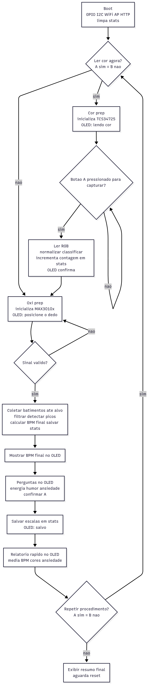
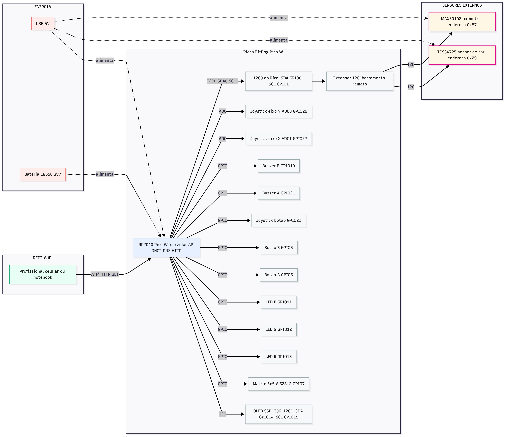
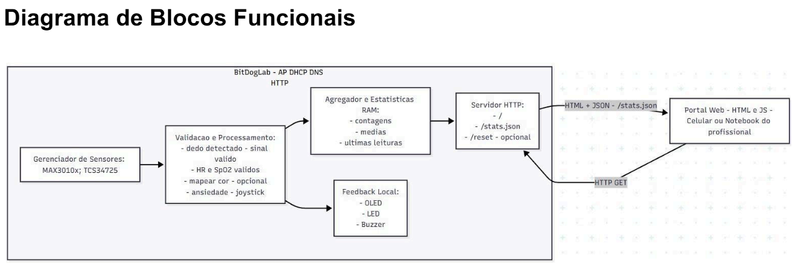
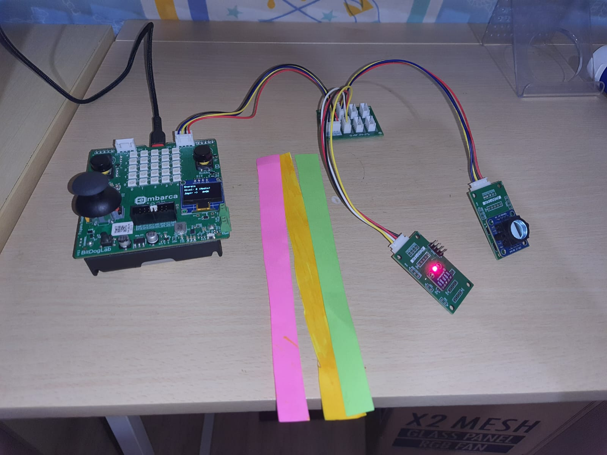
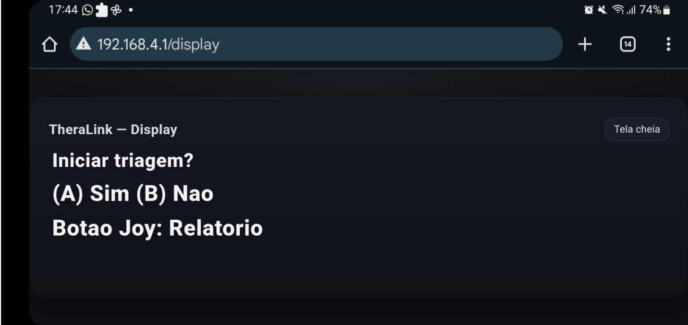
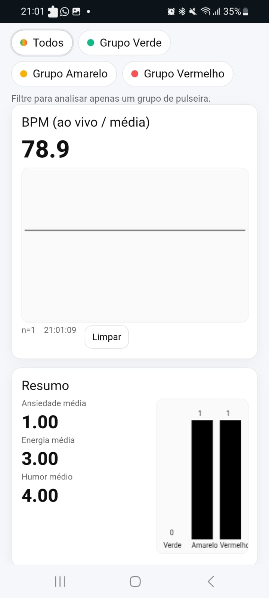

# Projeto Final Embarcatech — TheraLink
**Alunos:** Wagner Junior e Pedro Henrique  
**Local:** EmbarcaTech — Brasília

### O que é o projeto

O **TheraLink** é um dispositivo de monitoramento coletivo criado para **salas de aula, grupos terapêuticos, oficinas e encontros comunitários**, especialmente em locais onde **não há internet confiável**. Ele permite que o responsável pela atividade obtenha, em poucos minutos, um **retrato fiel do estado emocional e físico do grupo** antes do início da sessão.

Cada participante faz um **check-in rápido**: coloca o dedo em um **sensor de batimentos cardíacos (MAX30102)**, responde na **tela OLED** (usando o joystick) a três perguntas sobre **energia**, **humor** e **ansiedade**, e confirma uma **pulseira ou token colorido** diante do **sensor de cor TCS34725**. Com essas informações, o sistema calcula um **nível de risco** e classifica cada pessoa em **verde, amarelo ou vermelho**, indicando se o grupo chega mais calmo, equilibrado ou agitado.

Todo o processamento acontece **localmente**, dentro da **BitDogLab (Raspberry Pi Pico W)**. A placa cria uma **rede Wi-Fi própria** apenas para exibir os resultados: o educador ou terapeuta se conecta a essa rede e acessa um **painel web local** para acompanhar, em tempo real, a média de batimentos, a distribuição das cores e as estatísticas de energia, humor e ansiedade. Nada é enviado para a internet e os dados permanecem **anônimos**, mas podem ser exportados em **CSV** para registro posterior.

Em resumo, o TheraLink oferece uma **fotografia instantânea do clima do grupo**, ajudando o profissional a **escolher dinâmicas adequadas** e a **priorizar cuidados** antes mesmo de a atividade começar.


> **Explicação técnica:** a placa é uma **BitDogLab (Pico W)**. Ela sobe um **ponto de acesso Wi-Fi**, roda **DHCP/DNS/HTTP**, lê o **MAX30102** (sensor batimentos) e o **TCS34725** (sensor cor), mostra mensagens no **OLED** e recebe respostas pelo **joystick**. A **prioridade** é calculada combinando BPM + respostas; as **estatísticas** ficam em memória e aparecem no painel web local.

---

## 1) Problema e motivação

### Por que isso existe?
Em atividades com **turmas grandes** (escolas, projetos sociais, acolhimento) que passaram por um evento traumático recente, quem conduz a sessão precisa de um **sinal rápido** de como o grupo está. Sem essa leitura inicial, a condução começa **no escuro**: a dinâmica pode ser calma demais para um grupo elétrico ou intensa demais para um grupo ansioso — o que **piora a experiência** de todo mundo.

Além disso, **conexão instável** é realidade em muitos lugares. Relatórios **UNICEF/ITU** indicam que **cerca de dois terços** das crianças e jovens **não têm internet em casa** [1]; mesmo em escolas, o Wi-Fi pode não dar conta. Ou seja, **soluções offline** e **fáceis de operar** fazem diferença de verdade na ponta.

### O que o TheraLink entrega de útil
O TheraLink foi feito para **reduzir atrito** e **dar contexto** em **~60 segundos** por pessoa:

- **Um dado objetivo:** **BPM** pelo oxímetro — não serve para diagnóstico médico, mas ajuda a indicar **tensão** ou **agitação** (baseado em achados de HRV/arousal) [4][5].  
- **Três sinais subjetivos:** **energia**, **humor** e **ansiedade**, em escala simples (1–3), fáceis de responder no **OLED + joystick** (inspirado em materiais de educação socioemocional) [2][3].  
- **Uma síntese visual:** **verde / amarelo / vermelho** como **prioridade**, inspirada em esquemas de **triagem** amplamente entendidos pela população [6][7]. A cor é **validada** por um **sensor de cor**, o que torna a experiência **lúdica** e **inclusiva** (especialmente com crianças).  
- **Visão do grupo em tempo real:** no **painel web local**, o profissional vê **médias**, **contagens por cor** e **gráfico** de BPM, sem depender de internet.

### De onde veio a ideia (inspirações)
- **Organizar emoções em eixos simples** (energia/valência) vem de materiais de **SEL** como o **RULER/Mood Meter** do Yale, ajudando a transformar sentimentos em **informação prática** [2][3].  
- **Usar batimentos/HRV** como **proxy de arousal/estresse** é comum em pesquisas (útil como **contexto**, não diagnóstico) [4][5].  
- **Prioridade por cores** no estilo **semáforo** (verde/amarelo/vermelho) é um padrão de **comunicação instantânea** inspirado em **triagem** (ex.: START) [6][7].

### O ganho na prática
Com o TheraLink, a sessão começa **mais informada**: em poucos minutos, você tem uma **fotografia do grupo** (ex.: “metade verde, 30% amarelo, 20% vermelho; BPM médio 78; ansiedade média 2,0”). Isso ajuda a **escolher dinâmicas**, **priorizar atenção** e **acompanhar a evolução** ao longo do encontro — tudo **sem internet**, com **baixo custo** e **operação simples**.

---

## 2) Como funciona na prática (simulação do uso)
1. **Liga o dispositivo**. Ele cria um **AP Wi-Fi** aberto chamado **`TheraLink`** (endereço local **`192.168.4.1`**).  
2. O participante posiciona o dedo no **oxímetro (MAX30102)**. O sistema mede **BPM** (e usa o valor final no registro).  
3. No **OLED** ou **Display Externo**, com o **joystick**, o participante informa **Energia**, **Humor** e **Ansiedade** (escala 1..3).  
4. O algoritmo `triage_decide(...)` calcula um **nível de risco** e **recomenda uma pulseira** (**verde/amarelo/vermelho**).  
5. Em seguida, o sensor **TCS34725** valida a **cor** da pulseira (lido no punho) por **razões R/G** estáveis.  
6. O sistema **salva o registro** em memória (RAM) e atualiza **médias/contagens**. As telas do **OLED** e a rota web **`/display`** mostram as mensagens em tempo real.  
7. A profissional se conecta ao AP **TheraLink** pelo celular/notebook e acessa **`http://192.168.4.1/`** para ver o **Painel** (gráfico de BPM, KPIs e contagem por cores). Também há **`/stats.json`** e **`/download.csv`**.

> **Observação:** os dados ficam **locais** (RAM). O **CSV** é um **agregado** para exportação rápida. Não há armazenamento em nuvem.

## Imagem do Fluxograma de Software



---

## 3) Requisitos Funcionais (RF)
- **RF01.** Acesso via **portal web local** (HTML/JS + JSON) hospedado pelo próprio dispositivo (**sem internet**).  
- **RF02.** Medição de **BPM** com **MAX30102** (suporte a MAX30100/30102).  
- **RF03.** **Autoavaliação** no **OLED** (joystick): **Energia**, **Humor**, **Ansiedade** (1..3).  
- **RF04.** **Recomendação de pulseira** via `triage_decide(...)` com faixas de BPM + escalas.  
- **RF05.** **Validação de cor** no braço com **TCS34725** (verde, amarelo, vermelho; tolerâncias por **razões R/G**).  
- **RF06.** **Consolidação em RAM**: média robusta de BPM, contagem por cor e médias de escalas.  
- **RF07.** **Feedback imediato**: telas no **OLED** (espelhadas em **`/display`**) e efeitos/LEDs.  
- **RF08.** **Painel do profissional** em **`/`** e **APIs**: **`/oled.json`**, **`/stats.json`** (com filtro `?color=`) e **`/download.csv`**.

---

## 4) Requisitos Não Funcionais (RNF)
- **RNF01.** Operação **100% offline**.  
- **RNF02.** Preparado para **ambientes sem Wi-Fi externo** (AP próprio).  
- **RNF03.** **Interação rápida**: ~**60 s por pessoa** (meta).  
- **RNF04.** Interface **inclusiva** com feedback **visual** (OLED/cores/LEDs).  
- **RNF05.** **Privacidade**: processamento local (sem Nuvem; exportação agregada em CSV).  
- **RNF06.** **Baixo custo** e montagem simples.

---

## 5) Hardware & Ligações (BitDogLab)

## Diagrama de Hardware



## Blocos Funcionais



Periféricos utilizados:
  - **OLED (SSD1306) — I²C1**  
    `SDA = GP14`, `SCL = GP15`, **ADDR = 0x3C`
  - **Sensor de Cor (TCS34725) — I²C0**  
    `SDA = GP0`, `SCL = GP1`
  - **Oxímetro (MAX3010x) — I²C0**  
    `SDA = GP0`, `SCL = GP1`
  - **Botões**: `BUTTON_A = GP5`, `BUTTON_B = GP6`  
  - **Joystick**: `X = ADC1/GP27`, `Y = ADC0/GP26`, **Botão = GP22`

  > **SSID do AP:** `TheraLink` (aberto, sem senha, conforme `web_ap.c`).  
  > **Gateway/host:** `192.168.4.1`.

## 6) Materiais (versão atual)
- **1× BitDogLab** (RP2040 Pico W com **OLED**, **matriz 5×5**, **joystick**, **Wi-Fi**)
- **1× Extensor I²C** (para levar o barramento I²C0 até os conectores J3/J4)
- **1× Oxímetro MAX30102** (I²C)
- **1× Sensor de cor TCS34725** (I²C)
- **Jumpers Dupont**, **fita dupla-face**, **power-bank** (ou fonte USB 5 V)

---

## 7) Ligações (hardware)
### 2.1. Barramento I²C da BitDogLab
- O **OLED** da BitDogLab usa **I²C1** (interno da placa).
- Os **sensores externos** (oxímetro + cor) usam **I²C0**.

### 2.2. Conexões com o extensor I²C (I²C0)
1. Conecte o **extensor I²C** à **entrada I²C0** da BitDogLab.  
   - **SDA (I²C0) → GP0**  
   - **SCL (I²C0) → GP1**  
   - VCC 3V3 e GND conforme o extensor.

2. No extensor, use os conectores:
   - **J3 → Oxímetro (MAX30102)**  
     - **SDA** (I²C)  
     - **SCL** (I²C)  
     - **3V3**  
     - **GND**
   - **J4 → Sensor de cor (TCS34725)**  
     - **SDA** (I²C)  
     - **SCL** (I²C)  
     - **3V3**  
     - **GND**

> O firmware já espera **I²C0 em GP0/GP1** para esses sensores.

---

## 8) Passo a passo de montagem (rápido)
1. **Fixe** o extensor I²C na BitDogLab e leve SDA/SCL/3V3/GND até ele.  
2. **Conecte o MAX30102 no J3** do extensor (atenção a VCC e GND).  
3. **Conecte o TCS34725 no J4** do extensor (atenção a VCC e GND).  
4. **Conferir**: nada invertido; cabos firmes; sem curto.  
5. Alimente a BitDogLab com **USB** (PC) ou **power-bank**.

---

## 9) Instalação & Build (compilação do firmware)

1. Configure o **Pico SDK** (com **cyw43** e **lwIP** habilitados para o Pico W).  
2. No diretório do projeto, gere a build (ex.: **CMake + Ninja**):
   ```bash
   mkdir build && cd build
   cmake .. -DPICO_BOARD=pico_w
   ninja
3. Foi utilizado VSCode no desenvolvimento do projeto, recomendado caso use Windows.
4. Nesse vídeo, tem um tutorial de como rodar projetos com a BitDogLab no VSCode: https://www.youtube.com/watch?v=uVK-OHy2XZg

## 10) Imagens



Na imagem acima é possível ver a BitDogLab conectada a um extensor i2c, que está fazendo a ponte entre os sensores de cor e o oxímetro com a BitDogLab. Também é possível ver o Display OLED disparando o texto para o usuário, porém é muito pequeno, por conta disso criamos um display externo que roda na mesma página do painel do profissional, para melhor visualização dos textos, com ele é possível que o usuário leia com mais facilidade os textos do display OLED:






Na imagem acima é possível ver o painel do profissional, que contêm um gráfico de barras contendo a quantidade de pacientes em cada grupo, o BPM médio do grupo, ansiedade, humor e energia média. Também é possível agrupar os dados por cada grupo, e fazer o download dos dados em uma planilha no formato CSV.

## Referências

1. UNICEF & ITU (2020) - “Two thirds of the world’s school-age children have no internet access at home.”
Link: https://www.unicef.org/press-releases/two-thirds-worlds-school-age-children-have-no-internet-access-home-new-unicef-itu

Link PDF: https://www.itu.int/en/ITU-D/Statistics/Documents/publications/UNICEF/How-many-children-and-young-people-have-internet-access-at-home-2020_v2final.pdf 

2. Yale Center for Emotional Intelligence — RULER (institucional)
Link: https://medicine.yale.edu/childstudy/services/community-and-schools-programs/center-for-emotional-intelligence/ruler/

3. RULER Approach — Mood Meter (recursos)
Link: https://rulerapproach.org/ruler-resources-for-families/

4. Shaffer, F.; Ginsberg, J. (2017) — “An Overview of Heart Rate Variability Metrics and Norms.” Frontiers in Public Health. 
Link: https://www.frontiersin.org/articles/10.3389/fpubh.2017.00258/full 

5. Kim, H. G., et al. (2018) — “Stress and Heart Rate Variability: A Meta-Analysis and Review of the Literature.” Psychiatry Investigation.
Link: https://pmc.ncbi.nlm.nih.gov/articles/PMC5900369/

6. FEMA — CERT Basic Training Participant Manual (2011) — “Simple Triage and Rapid Treatment (START)” (PDF)
Link: https://www.fema.gov/sites/default/files/2020-07/fema-cert_basic-training-participant-manual_01-01-2011.pdf

7. CERT-LA — START (folheto) (PDF)
Link: https://www.cert-la.com/downloads/education/english/start.pdf
